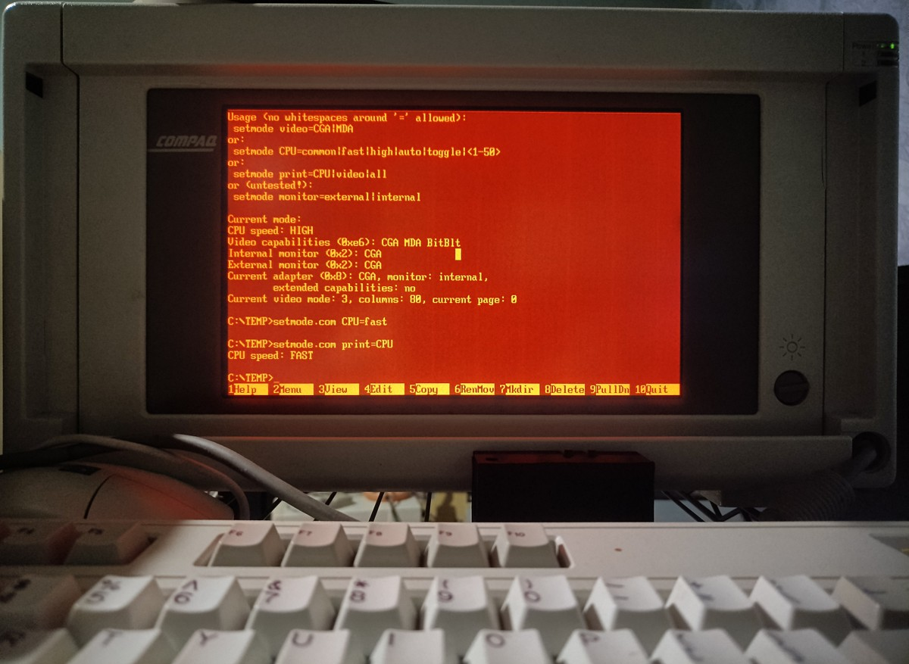

# Compaq Portable III and Portable 386 mode change utility

Compaq Portable III and Portable 386 are very similar, except for the CPU used. Both can change the video adapter used: MDA or CGA, CPU speed, and several other options.

MODE\.COM utility provided with the Compaq DOS can change these options, but it is linked with the exact DOS version. While writing an [article about those computers](https://indrekis.github.io/retrocomputing/ibm_pc_compat/2024/01/22/Compaq_Portable_III_n_386_1.html), (in Ukrainian, [though more or less translatable by Google](https://indrekis-github-io.translate.goog/retrocomputing/ibm_pc_compat/2024/01/22/Compaq_Portable_III_n_386_1.html?_x_tr_sl=uk&_x_tr_tl=en&_x_tr_hl=en&_x_tr_pto=wapp)), I decided to recreate some of its functionality to check if I understood corresponding "APIs" correctly.

Released under the [MIT License](LICENSE). No guarantees, as always. It could work, to some extent, with other similar Compaq models. Their support could be added in the future, though the chances are not too high.

## Usage

Currently is supported:

- retrieving information about the CPU speed, video-adapter usage, and capabilities:
  - ``setmode print=CPU|video|all``
- changing CPU speed:
  - ``setmode CPU=common|fast|high|auto|toggle|<1-50>``
  - Numerical codes are ignored on the Portable III (286) but acknowledged on the 386.
- changing video adapter used:
  - ``setmode video=CGA|MDA``
- untested (and, because of the long way debugging other features, possibly -- not working) feature -- switching to an external monitor and back:
  - ``setmode monitor=external|internal``

The ability to configure other properties and other computers could be added in the future.

QEMM386 and similar DOS extenders are detected -- they preclude correct operations.

|  |
|:------------------------------------------------:|
| Example of using the configurator on Portable III (286).|

## Using MODE\.COM

Using SETVER enables usage of the Compaq MODE\.COM from the DOS 3.31 (and other versions, I hope): ``MODE SPEED=HIGH``.

## Compilation

Compiles using the Open Watcom 2, project files are provided. If required, I can describe the building from the command line -- feel free to fire an issue.

Additional ASM utilities provided are compiled by the TASM (version 3.1 was used accidentally):

- SetCGA.ASM -- use CGA adapter,
- SetMDA.ASM -- use MDA adapter,
- SetHIGH.ASM -- set speed to HIGH,
- SetALL.ASM -- set CGA and maximal speed.

Code is rather quick and dirty.

All binaries are provided.
